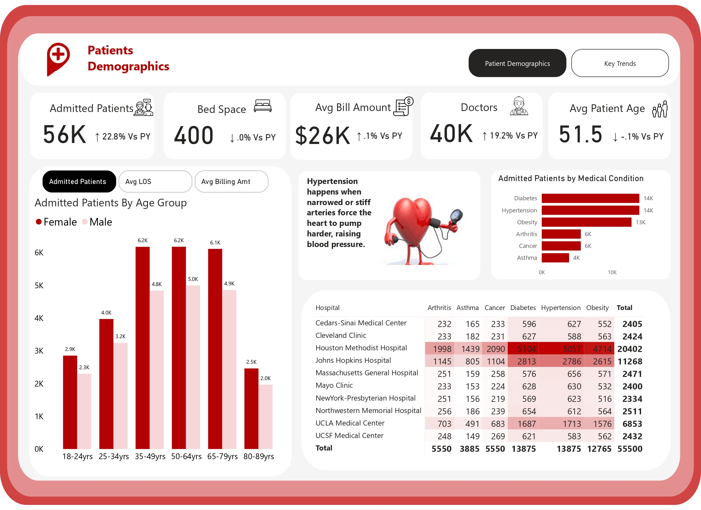
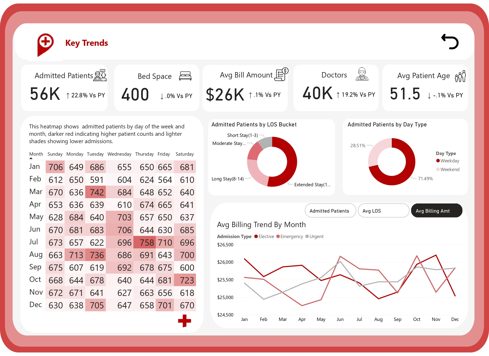

# Healthcare Admissions Dashboard

This project provides a comprehensive analysis of hospital admissions using the **Onyx Healthcare dataset**. The dashboard explores trends across patient demographics, admission frequency, length of stay, and billing amounts across multiple hospitals in the U.S.

Designed for healthcare stakeholders and analysts, this report helps uncover patterns that can support resource planning, policy decisions, and performance tracking in healthcare systems.

---

## Project Overview

Hospitals are constantly managing patient flow, billing, and care efficiency. This analysis aims to break down these areas by answering the following questions:
- Who are the patients being admitted, and what are their characteristics?
- What health conditions lead to the highest number of admissions?
- How do admission patterns vary by day, gender, and age group?
- What are the trends in billing amounts and average length of stay?

---

## Tools Used

- **Power BI** – Visualizations, DAX calculations, report design
- **Power Query** – Data cleaning and transformation
 

---

## 📈 Key Insights

 Patients                 |                                      Key Trends                                
:------------------------------|-----------------------------------------------:         
  |                        

### Patient Demographics
- Age groups 35–49 and 50–64 have the **highest number of admissions**
- Slightly **more male patients** were admitted than female patients
- Weekday admissions make up **over 70%** of total, showing consistent weekday demand

### Medical Conditions
- **Diabetes and Hypertension** had the highest and equal number of admissions (13,875 each)
- These two conditions may show similar trends due to **shared risk factors** such as poor diet, obesity, inactivity, and metabolic disorders

### Length of Stay (LOS)
- Most patients fall into the **Moderate Stay (4–7 days)** and **Short Stay (1–3 days)** categories
- Very few patients require extended hospital stays, which could signal effective turnover or limited high-risk cases

###  Billing Analysis
- **Average billing amount is $26,000**, with very minimal variation year-over-year
- Cost trends remain consistent across hospital types, signaling a standardized approach to billing for similar treatments

---

##  Recommendations

1. **Preventive Health Programs**  
   With diabetes and hypertension leading hospital admissions, hospitals and public health agencies should invest in community-level **preventive screenings**, **nutrition education**, and **lifestyle support programs** to reduce avoidable admissions.

2. **Targeted Weekday Staffing**  
   Since 71.49% of admissions happen on weekdays, hospital administrators can use this trend to **optimize staff schedules**, **allocate resources more efficiently**, and reduce weekday bottlenecks.

3. **Focus on Middle-Aged Populations**  
   Age groups 35–64 are most frequently admitted. Tailoring education and outreach to this group may help reduce preventable conditions and improve early intervention outcomes.

4. **Further Investigation into Billing Equity**  
   While average billing amounts are stable, a deeper drill-down by condition or patient group can help **identify disparities** in costs and support **equity in healthcare delivery**.

---

## 📊 Dashboard Link

Click the link below to explore the interactive Power BI dashboard:  
👉 [View Dashboard](https://app.powerbi.com/view?r=eyJrIjoiNTU0YTljMjctOWFiYi00NzdiLTkxOTctZGYwNTJmMDYxZTk5IiwidCI6Ijk2MjdhZDVhLTIzOTgtNGM4Yi1iZTQ3LWM3OGFhYWMxNmE0MSJ9)

Have suggestions or questions?  
Feel free to open an issue or connect with me directly. I’d love to hear your thoughts and feedback.

You can also reach out to me on [LinkedIn](https://www.linkedin.com/in/elizabeth-oluwafemi/) if you'd like to connect

